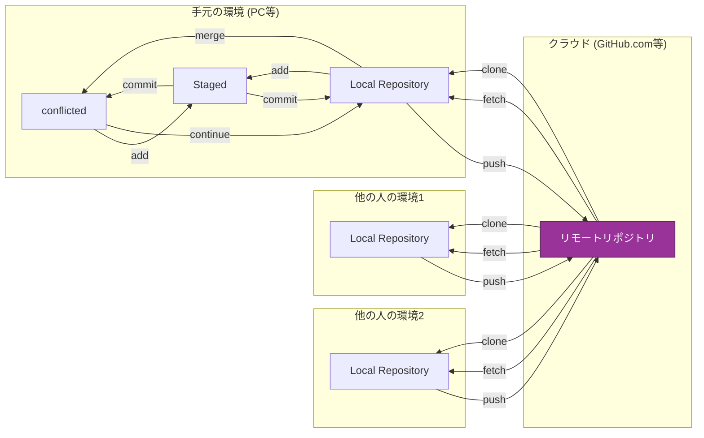

# Git と GitHub（初心者向け）

このリポジトリは、Git と GitHub をこれから学ぶ方向けのハンズオン教材です。copilotに手伝ってもらって、Markdown形式にまとめました。

## 対象

- レベル: git / github の入門者
- 前提知識: linuxでの基本的なコマンドライン操作（`cd`, `ls`, `cat`）

## 目次

1. はじめに
2. 学習環境の準備（Git のインストール、GitHub アカウント作成）
3. Git 基本（リポジトリ、ステータス、コミット）
4. ブランチの基本（作成・切替・マージ）
5. リモートと GitHub（push, pull, fetch, origin）
6. プルリクエストとコードレビュー（GitHub 上の操作）
7. 実践ワークフロー（Feature ブランチ、レビュー、リリース）
8. トラブルシューティング（コンフリクト、revert, reset）
9. 練習問題（ローカル演習＋リモート演習）
10. 便利なコマンドチートシート
11. 参考資料・リンク

## はじめに（概要）

この教材の目的は、実際に手を動かしてGit/GitHubの基本操作を習得することです。各章は説明→実例→練習課題の順で構成します。

## クイックスタート（ローカルで手を動かす）

1. このフォルダに移動します:

```bash
cd /home/masa/figures/examples
```

2. セットアップスクリプトを実行して練習用リポジトリを作成します:

```bash
bash setup_demo.sh
```

スクリプトはローカルに `demo-practice` を作成し、サンプルコミットとブランチを用意します。



## 次のステップ

1. `lessons` の各章に目次の詳細アウトラインを反映（担当: 自分・目安: 1日）
2. `01 学習環境の準備` を完成させて動作確認（担当: 自分・目安: 半日）
3. `examples/setup_demo.sh` を使ってローカルでハンズオンを実行してみる（担当: 自分・目安: 30分）
