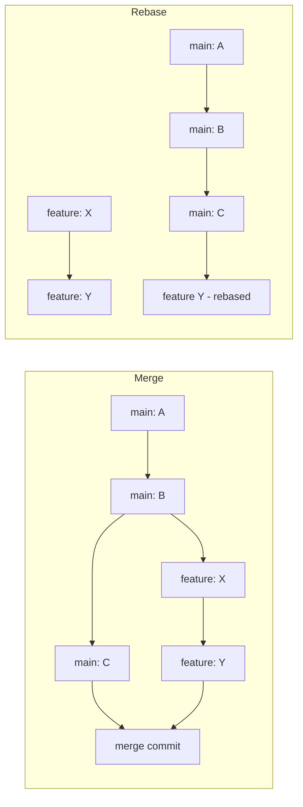

# 02 Git 基本

## 目的
- リポジトリの初期化、ファイルの追跡、コミットの基本を学ぶ

## 主なコマンド
- `git init`
- `git status`
- `git add <file>`
- `git commit -m "message"`
- `git log`

## 例
```bash
mkdir demo && cd demo
echo "Hello" > README.md
git init
git add README.md
git commit -m "Add README"
```

## 練習課題
- 新しいディレクトリでリポジトリを作成してファイルをコミットする

## 詳細解説（初心者向け）

### ワーキングツリー、ステージ、ローカルリポジトリ
- ワーキングツリー: 実際のファイル
- ステージ（インデックス）: 次にコミットされるファイルの一覧（`git add` で追加）
- ローカルリポジトリ: コミット履歴が保存される場所（`git commit`）

### ファイルのライフサイクル（例）

```bash
# ファイルを作成
echo "Hello" > file.txt
# 変更をステージ
git add file.txt
# ステージされた変更をコミット
git commit -m "Add file.txt"
# ステータス確認
git status
# 履歴確認
git log --oneline --graph --decorate --all
```

### コミットメッセージの書き方（簡単なガイド）
- 1行目は短く（50文字程度）に要約
- 空行を1行挟んで詳細を書く（必要な場合）
- 命令形で書く（例: "Add README"、"Fix typo"）

### よく使う履歴表示オプション
- `git log --oneline`：一行表示
- `git log -p`：差分付き
- `git show <commit>`：特定コミットの詳細

### 変更の取り消し（よくある操作）
- 作業ツリーの変更を元に戻す（まだステージしていない場合）
	`git restore <file>`
- ステージから外す（`git add` を取り消す）
	`git restore --staged <file>`
- 直近コミットを修正して追加の変更を取り込みたい場合
	`git commit --amend`（公開済みコミットには注意）

### マージとリベース（merge vs rebase）

どちらも別ブランチの変更を取り込む方法ですが、履歴の扱いが異なります。

- マージ (`git merge <branch>`)：
	- ブランチを統合すると自動でマージコミットが作られる（履歴に"合流点"が残る）。
	- 履歴の流れが分岐・合流としてそのまま残るため、どのブランチで作業したか追いやすい。
	- コラボレーションでは安全（公開済み履歴を書き換さない）。

	例:
	```bash
	git checkout main
	git merge feature/abc
	```

	コンフリクトが発生した場合:

	1. Git が該当ファイルを報告します（`git status` で確認）。
	2. エディタで `<<<<<<<` / `=======` / `>>>>>>>` の区切りを見て手動で修正します。
	3. 修正後、`git add <file>` を実行してから `git commit` でマージコミットを確定します。
	4. 補助ツールとして `git mergetool` を使うこともできます。

- リベース (`git rebase <base>`)：
	- feature ブランチのコミットを base ブランチの先頭に"載せ替える"。
	- 履歴が直線的になり読みやすくなるが、既に公開されたコミットをリベースすると他者に影響が出る。
	- 個人作業中やマージ前に履歴を整理する用途で有用。

	例:
	```bash
	git checkout feature/abc
	git fetch origin
	git rebase origin/main
	# コンフリクトが出たら修正して
	git add <file>
	git rebase --continue
	```


推奨ルール（例）:
- チームでは基本的に `merge` を使い、個人的な履歴整理や PR 前の微調整に `rebase` を使う。
- リベース後にリモートに push する場合は `git push --force-with-lease` を使って安全性を高める。

### Merge と Rebase の簡易図




## ハンズオン練習（ステップバイステップ）

1. 新しいディレクトリで作業開始:

```bash
mkdir git-demo && cd git-demo
git init
```

2. ファイルを作ってコミット:

```bash
echo "# Git Demo" > README.md
git status
git add README.md
git commit -m "Initial commit: add README"
```

3. 変更をして差分を確認、ステージ、コミット:

```bash
echo "Some notes" >> README.md
git status
git diff      # ステージしていない差分の確認
git add README.md
git commit -m "Update README with notes"
```

4. コミット履歴を確認:

```bash
git log --oneline --graph --decorate
```

---

次は `03 ブランチの基本` に実践的な演習とマージの注意点を追加します。
